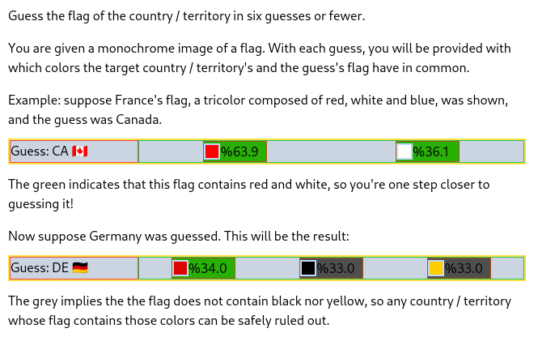

A simple, fun, flag guessing game, inspired by Wordle! <br>

Built using: React.js, TypeScript <br>

To run locally:

Clone the repository

```
$ git clone https://github.com/ehugithub/flagdle
$ cd flagdle
```

Run the project

```
$ npm install
$ npm run start
```

<br>

How to play:  

